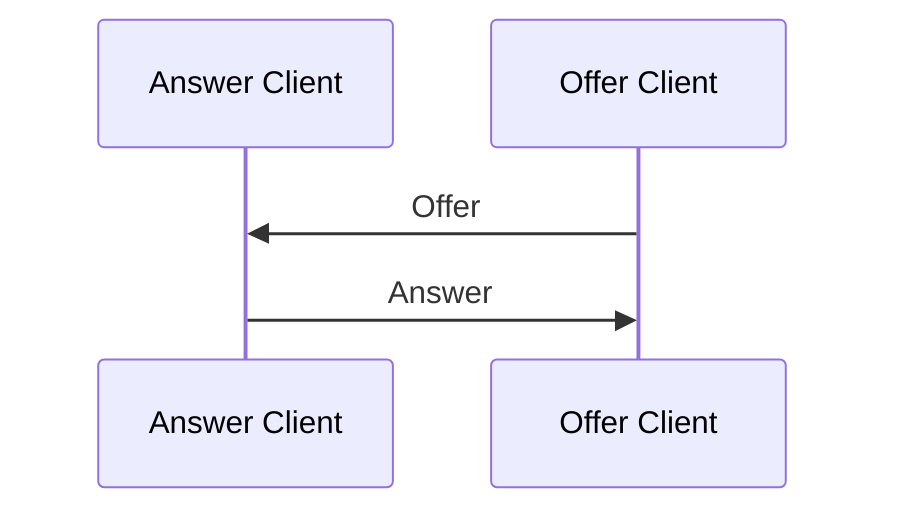

An **Answer** is a type of session that is initiated by a client
and is used to respond to an **Offer** from another client.


## Peering

TODO: add Tabs

```typescript
// Wait for the Offer and send the Answer
client.peer(requestId, "offer").then((dc)=>{
  // Handle the Data Channel
})
```
