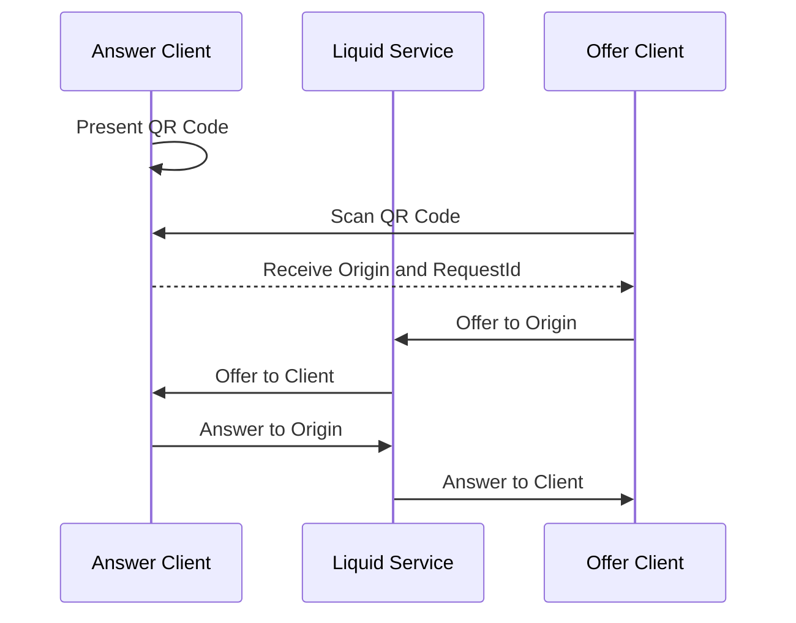

Both clients listen for each other's **Offer** and **Answer** messages at the relay service.
Once the QR code is scanned, the **Offer** client proves it's identity then sends an **Offer** message to the **Answer** client.
The **Answer** client then sends an **Answer** message to the **Offer** client,
and the two clients can communicate over the P2P connection.

