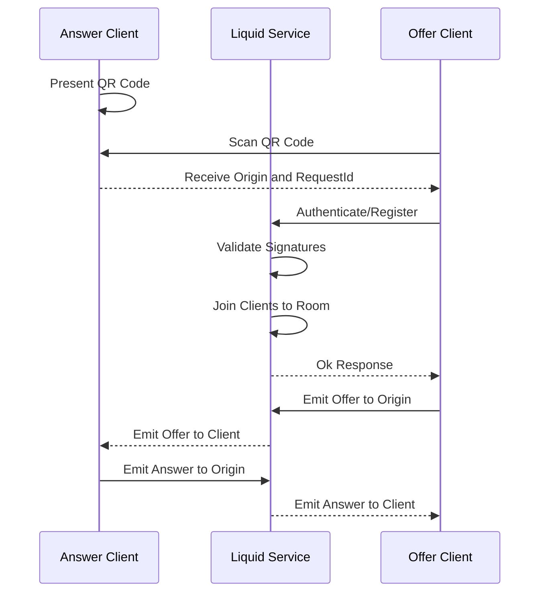
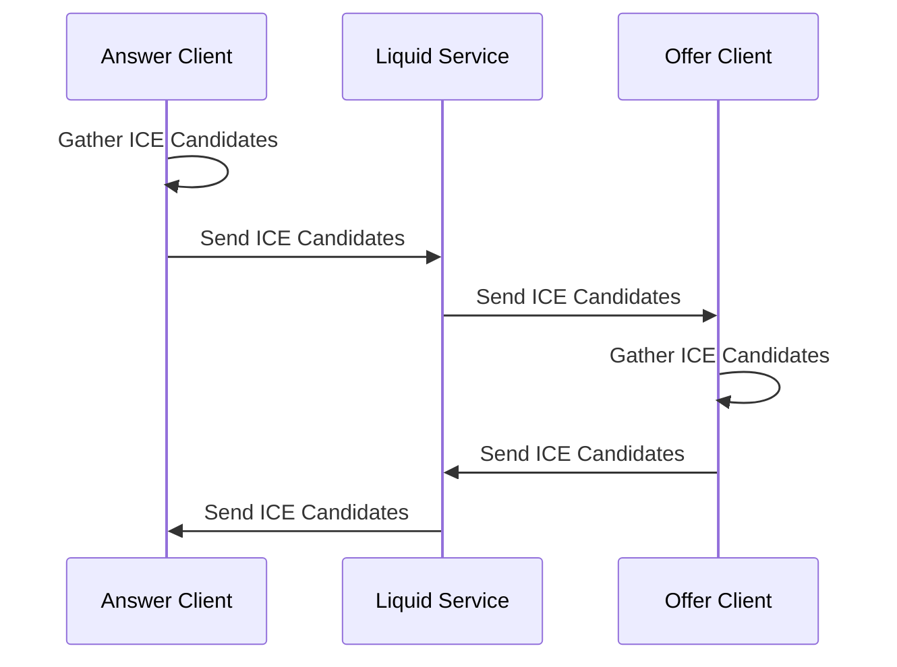
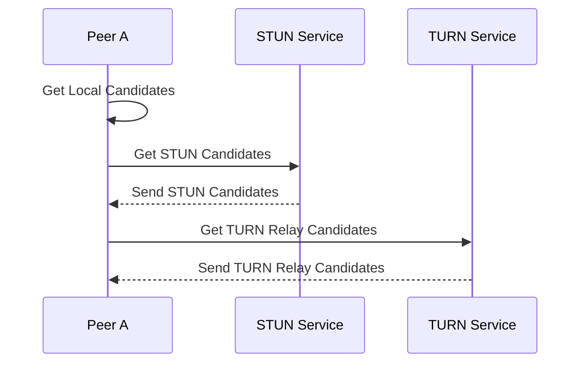

Both clients listen for each other's **Offer** and **Answer** messages at the relay service.
Once the [Deep Link](/guides/linking/#deep-link) is received,
the **Offer** client proves its identity using the [Liquid Extension](/guides/passkey/extension)
then sends an **Offer** message to the **Answer** client.
The **Answer** client then sends an **Answer** message to the **Offer** client.

## ICE Candidates

The clients exchange ICE candidates to establish a connection.
The ICE candidates are used to determine the best path for the data to travel between the clients.
The clients exchange ICE candidates over the signaling server via WebSockets.

### Candidate Discovery

STUN and TURN servers are used as a fallback when a local connection cannot be established on the LAN.
The STUN server is used to discover the client's public IP address,
while the TURN server is used to relay data if a direct connection to public IP cannot be established.

The following diagram shows the exchange of STUN/TURN candidates with a client.

