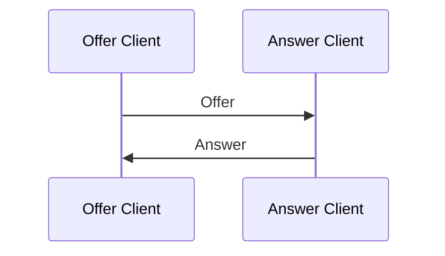

import {Aside} from '@astrojs/starlight/components';

<Aside>The client must authenticate the request prior to sending the offer. See Linking for more information</Aside>

An **Offer** is a type of session that is initiated by a client
and is used to request an **Answer** from another client.


## Peering

TODO: add Tabs

```typescript
// Send the Offer and wait for the Answer
client.peer(requestId, "answer").then((dc)=>{
  // Handle the Data Channel
})
```
