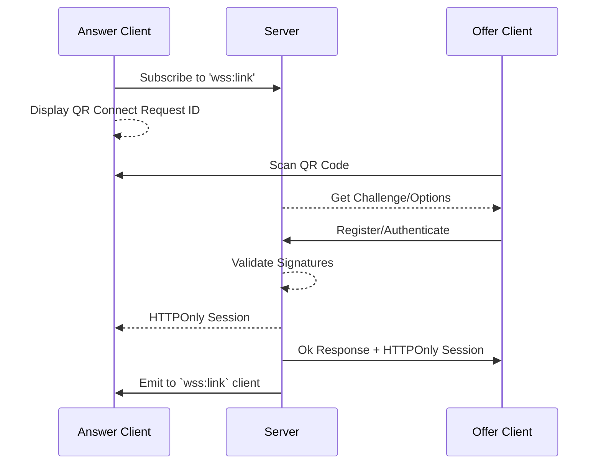

import { Aside } from "@astrojs/starlight/components";

<Aside>
  We recommend following the Peer-to-Peer guides to understand how to establish a connection between clients
</Aside>

A link will authorize a remote client to access the service.
This is done by generating a `requestId` and waiting for a device to attest a [Passkey](/guides/concepts/#-passkeys).

A link event can only be acknowledged by the service when the remote client has successfully authenticated.
The linking processs is backed by a [Deep Link](#deep-link) and a [QR Code](#qr-code).
The `SignalClient` is responsible for generating the deep link and presenting to another client.

The remote client will handle the `Deep Link` by submitting a `Passkey` with the [Liquid Extension](/guides/passkey/extension) to the origin service.
Once the service has validated the linking request, the client will be able to communicate with the service and establish a peer-to-peer connection.


### Who is this for?

- **dApps/Wallets** that want to integrate deeply into `Liquid Auth`.


## Deep Link

Liquid uses a custom deep link to handle linking between devices.

The format is as follows:

```
liquid://<ORIGIN>/?requestId=<UUID_OF_REQUEST>
```

This link will be used to generate a QR code for the user to scan with their device.

#### Origin

The origin is the server that will handle the linking request.


#### Request ID

The request ID is a UUID generated by a client to identify the linking request.

## QR Code

We recommend displaying the deep link as a QR code for the user to scan with their device.
Try it out by downloading the [demo Android](https://github.com/algorandfoundation/liquid-auth-android/releases) application and scanning the QRCode below.

<div id="parent-div" hx-get="/demo/"
     hx-trigger="load"
     hx-swap="innerHTML">Loading</div>


### Diagram

This diagram illustrates the linking process between a website and a wallet.


